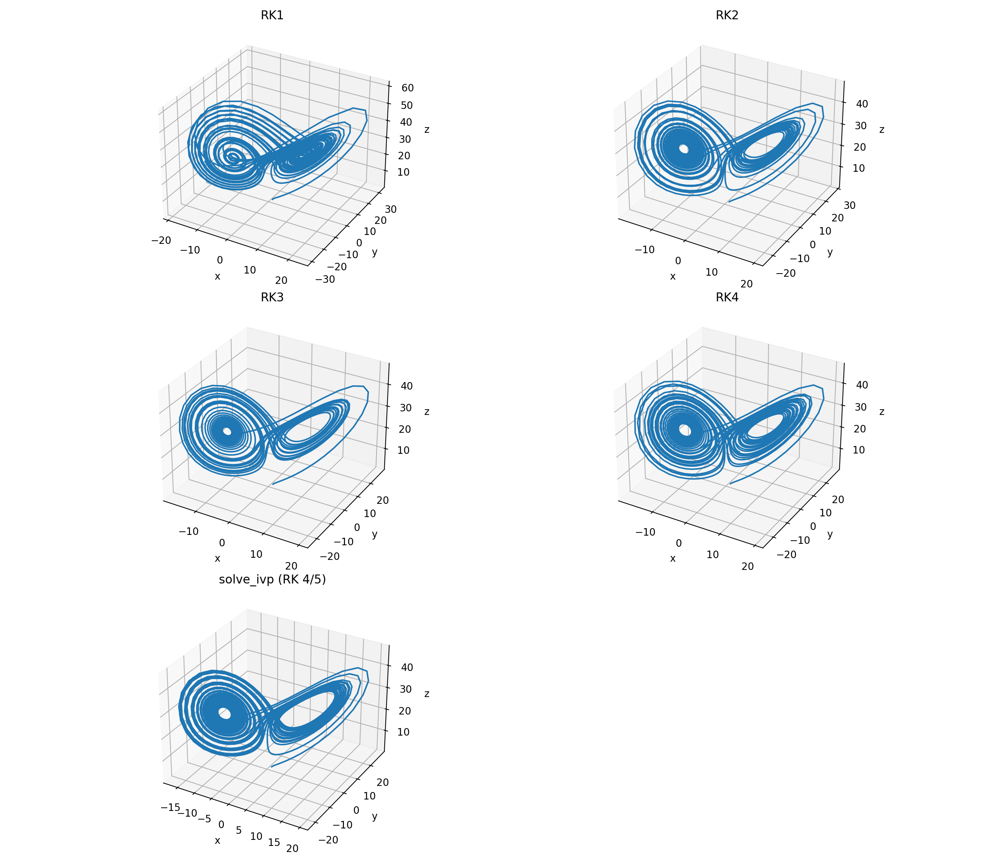

# Lorenz system and Lorenz attractor

This repository contains the code for the blog post on [Solving the Lorenz system using Runge-Kutta methods](https://www.fabriziomusacchio.com/blog/2020-10-04-rk_and_lorenz_system/). For further details, please refer to this post.



For reproducibility:

```powershell
conda create -n lorenz_system -y python=3.9
conda activate lorenz_system
conda install mamba -y
mamba install -y numpy matplotlib scikit-learn ipykernel
```
